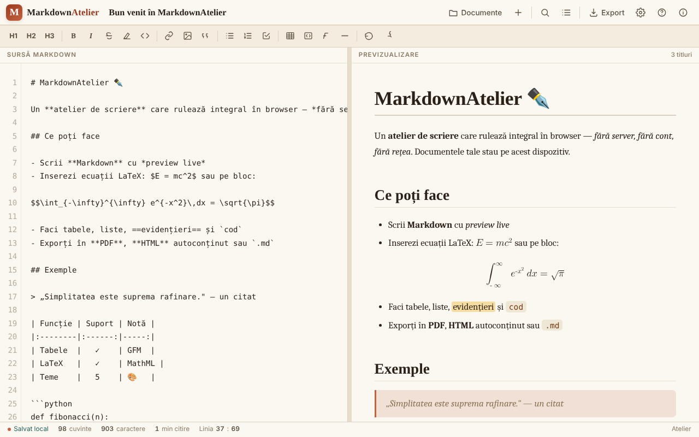

# MarkdownAtelier

Atelier de scriere Markdown cu previzualizare, export și documente salvate local.

**Live:** https://chiuta.github.io/MarkdownAtelier/

## Ce este

MarkdownAtelier este un editor Markdown dintr-un singur fișier HTML, cu previzualizare în paralel, gestionar de documente, căutare/înlocuire și export în .md, .html și PDF (prin tipărire). Documentele rămân în browserul tău.

## Funcții

- Editor („Editor") și previzualizare („Preview"), cu scroll sincronizat opțional și „Mod focus".
- Bară de formatare (H1, H2, H3, B, I etc.), contor de cuvinte, caractere și minute de citire, indicator „Linia : coloana".
- Sintaxă: titluri, bold, italic, tăiat, ==evidențiat==, cod inline, ~sub~, ^sup^, liste și checklist, citate, tabele GFM, note de subsol, blocuri de cod cu limbaj, ecuații `$inline$` și `$$bloc$$` (LaTeX convertit în MathML nativ), cuprins automat `[[toc]]`, detalii pliabile `::: details`.
- Setări: temă, limba interfeței (English, Română, Français, Italiano, Español, Português, Deutsch), word wrap, numere de linie, auto-numerotare titluri în cuprins, tipografie inteligentă, coduri emoji (`:rocket:` devine 🚀), dimensiunea textului.
- Documente: „Importă .md", „＋ Document nou", listă de documente.
- Export: .md, .html autoconținut, PDF (print), „Copiază HTML în clipboard"; panou de cuprins și ajutor cu sintaxa.

## Manual de utilizare

Scurtături de tastatură (afișate în aplicație):

- Ctrl B îngroșat, Ctrl I italic, Ctrl K link, Ctrl ` cod inline
- Ctrl F caută / înlocuiește
- Ctrl S salvează
- Ctrl E export
- Ctrl O documente
- Ctrl Alt N document nou
- Tab indentare

Pași:

1. Scrie în panoul „Sursă Markdown"; previzualizarea apare alături; comutatoarele ✍️ Editor și 👁️ Preview aleg panoul afișat.
2. Gestionează documentele din „Documente" (Ctrl O): „Importă .md" sau „＋ Document nou".
3. Exportă din „Export" (Ctrl E): „↓ .md", „↓ .html", „🖨 PDF" (se alege „Salvează ca PDF" în dialogul de tipărire) sau „⧉ Copiază".
4. Ajustează tema, limba și opțiunile din „Setări".
5. Pentru a șterge tot ce a salvat aplicația, folosește „Șterge toate datele" din Setări.

## Confidențialitate și rețea

- Documentele și setările se păstrează în `localStorage` (chei `markdownatelier.v1` și `markdownatelier.settings.v1`); indicatorul „Salvat local" arată starea.
- Aplicația nu face cereri de rețea (fără `fetch`, CDN sau scripturi externe). Conține doar link-uri, deschise la click, către Patreon, Buy Me a Coffee și chiuta.github.io.
- Datele nu se sincronizează între dispozitive; pentru backup exportă fișierele.

## Rulare locală / offline

Descarcă `index.html` și deschide-l în browser; nu necesită internet.

## Licență

CC0 1.0 Universal (domeniu public) — vezi fișierul LICENSE

## Autor

Alexio — Alexandru-Ionuț Chiuță, contact: alexio@trom.tf

## English summary

MarkdownAtelier is a single-file Markdown editor with live preview, document manager, find/replace, LaTeX-to-MathML equations, tables, footnotes and export to .md, .html and PDF (via print). Documents are kept in the browser's localStorage. 7 UI languages. No network requests.
